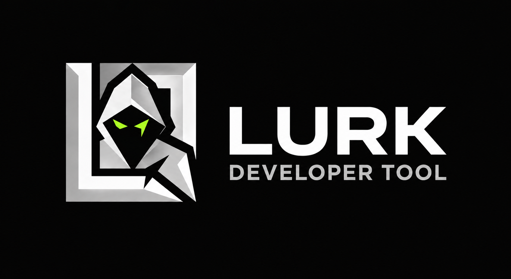

<p align="center">
  
</p>

<h1 align="center">LURK</h1>

<p align="center">
  <strong>User Interaction-Based Runtime Testing & Engineering Intelligence Framework</strong>
</p>

<p align="center">
  An end-to-end telemetry and diagnostics system that captures real browser session interactions, correlates runtime failures with preceding user actions, and delivers AI-driven engineering assessments.
</p>

---

## System Architecture & Layers

```
┌────────────────────────────────────────────────────────┐
│  Layer 1: Chrome Extension                             │
│  Captures clicks, network calls, errors, long tasks    │
└──────────────────────────┬─────────────────────────────┘
                           │ Raw Telemetry Package
                           ▼
┌────────────────────────────────────────────────────────┐
│  Layer 2: Data Processing Engine                       │
│  Normalizes & extracts deterministic pattern findings  │
└──────────────────────────┬─────────────────────────────┘
                           │ Normalized Batches
                           ▼
┌────────────────────────────────────────────────────────┐
│  Layer 4: Application Backend (Express + Supabase)     │
│  Orchestrates pipeline, stores sessions & findings     │
└──────────────┬──────────────────────────┬──────────────┘
               │ (POST /analyze)          │ (REST API)
               ▼                          ▼
┌──────────────────────────────┐  ┌──────────────────────┐
│  Layer 3: AI Service (Python)│  │  Layer 5: LURK Web UI│
│  Groq LLM runtime diagnostics│  │  React / Vite UI     │
└──────────────────────────────┘  └──────────────────────┘
```

### Layer Summary

1. **`extension/` (Layer 1 — Browser Telemetry Ingestion)**  
   Manifest V3 Chrome extension that tracks user clicks, form interactions, console exceptions, Fetch/XHR network requests, long tasks (>50ms), and SPA history navigations.

2. **`data-processing/` (Layer 2 — Deterministic Engine)**  
   Pure TypeScript processing engine that normalizes raw telemetry, correlates runtime errors and slow network requests with preceding user interactions, and extracts structured engineering findings.

3. **`ai-service/` (Layer 3 — AI Diagnostic Inference Service)**  
   FastAPI Python microservice powered by Groq LLM (with offline deterministic fallback) that transforms telemetry evidence into actionable engineering assessments, root cause interpretations, and remediation steps.

4. **`application/` (Layer 4 — Backend API & Analysis Orchestrator)**  
   Node.js/Express service connected to Supabase PostgreSQL. Manages session ingestion, database persistence, analysis pipeline orchestration, and exposes a REST API for the dashboard.

5. **`frontend/` (Layer 5 — LURK Dashboard UI)**  
   Modern React + TypeScript dashboard with fixed-frame navigation, clean HTML5 URL routing, and real-time visualization of sessions, monitored origins, and page diagnostics.

---

## How to Run the Entire Project Combined

### Prerequisites
- **Node.js**: v18+ and **npm**
- **Python**: 3.10+ and **pip**
- **Supabase**: PostgreSQL database with schema tables (`monitoring_sessions`, `monitored_websites`, `monitored_pages`, `page_routes`, `runtime_events`, `ai_analysis_batches`, `engineering_findings`)
- **Groq API Key**: (Optional for LLM mode, fallback operates fully offline)

---

### Step 1: Start the Python AI Service (Layer 3)
```powershell
cd "ai-service"
python -m venv venv
.\venv\Scripts\Activate.ps1
pip install -r requirements.txt

# Start service on port 8001 (or 8000)
python -m uvicorn app.main:app --host 127.0.0.1 --port 8001 --reload
```

---

### Step 2: Start the Application Backend (Layer 4)
```powershell
cd "application"
npm install

# Ensure .env is configured with SUPABASE_URL, SUPABASE_SERVICE_ROLE_KEY, and AI_SERVICE_URL
npm run dev
# Server starts on http://localhost:3001
```

---

### Step 3: Start the LURK Frontend Dashboard (Layer 5)
```powershell
cd "frontend"
npm install
npm run dev
# Dashboard opens on http://localhost:3000
```

---

### Step 4: Build & Load the Chrome Extension (Layer 1)
```powershell
cd "extension"
npm install
npm run build
```
1. Open Google Chrome and navigate to `chrome://extensions`.
2. Enable **Developer mode** in the top right.
3. Click **Load unpacked** and select the `extension/dist` folder.
4. Click the LURK extension icon on any target webpage and click **Start Monitoring**.
5. Browse and interact with the page, then click **Stop Monitoring & Save** to persist telemetry to the backend.
6. Open the LURK Dashboard at `http://localhost:3000` to inspect captured sessions and run AI diagnostics.
